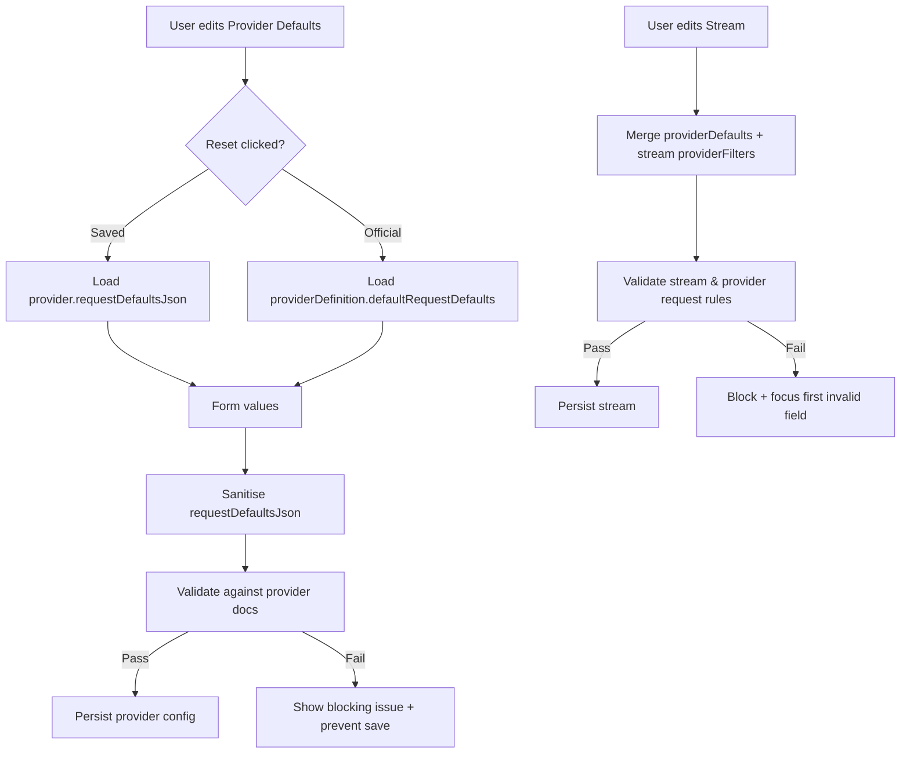

# Gap-focused review prompt for NewsPub stream/provider defaults, validation, and form contrast

## Executive summary
The codebase already has strong stream-side validation and reset primitives, but provider-default editing lacks authoritative validation and a “restore official defaults” capability. The stream/provider UI also relies on near-identical surface gradients, making inputs and disclosure sections visually merge into their backgrounds; targeted contrast adjustments are needed to meet WCAG non-text contrast expectations. citeturn10search0turn10search1

## Gap checklist and exact change locations
The table below is the working checklist. Make changes only where referenced.

| Gap | Current behaviour (observed) | Desired behaviour | Exact locations to change | How to locate if moved/renamed |
|---|---|---|---|---|
| Provider defaults: reset to official defaults | Provider editor resets mostly to *saved/current* values via re-mount keys (no “restore official provider defaults” for an existing provider config). | Add a clear “Restore official defaults” action that loads `defaultRequestDefaults` from provider definitions for the selected provider. | `src/components/admin/provider-form-card.js` (`ProviderFormCard`, `requestDefaultsResetKey`, `nextRequestDefaults`, “Reset request defaults” button). | `rg -n "Reset request defaults|requestDefaultsResetKey|defaultRequestDefaults" src` |
| Provider defaults: guard invalid settings | Provider defaults can be saved with only basic sanitisation; UI validation summary is hardcoded `items={[]}`. | Validate provider defaults against official provider rules and show blocking feedback before save (UI + server-side enforcement). | UI: `src/components/admin/provider-form-card.js` (`AdminValidationSummary`). Server: `src/app/admin/actions.js` (`saveProviderAction`), `src/features/providers/index.js` (`saveProviderRecord`), optionally `src/app/api/providers/route.js` schema constraints. | `rg -n "saveProviderAction|saveProviderRecord|requestDefaultsJson|AdminValidationSummary" src` |
| Stream/provider guard: provider-specific request rules incomplete | Stream validation uses `getProviderRequestValidationIssues`, but it only includes limited rules for the NewsAPI integration; other providers lack request-rule validation. | Expand provider-specific validation to cover documented constraints (especially NewsData archive/date range and exclusion semantics; NewsAPI query requirements and limits; execution limits). | `src/lib/news/provider-definitions.js` (`getProviderRequestValidationIssues`, `providerExecutionLimits`). Stream validator already calls it: `src/lib/validation/configuration.js` (`getStreamValidationIssues`). | `rg -n "getProviderRequestValidationIssues|providerExecutionLimits|getStreamValidationIssues" src` |
| Stream/provider guard: execution limits missing for NewsAPI/NewsData | `providerExecutionLimits` only defines limits for `mediastack`; streams can set `maxPostsPerRun` beyond provider API caps, and backend won’t reject. | Add execution caps aligned with provider docs (NewsAPI pageSize max 100; NewsData “size” is plan-dependent — pick a safe max and document). | `src/lib/news/provider-definitions.js` (`providerExecutionLimits` map). Stream form and backend already consume it: `src/components/admin/stream-form-card.js` + `src/lib/validation/configuration.js`. | `rg -n "providerExecutionLimits|maxPostsPerRun" src/lib/news/provider-definitions.js src/components/admin/stream-form-card.js src/lib/validation/configuration.js` |
| Stream reset: when provider defaults are empty/invalid | Stream “Reset to provider defaults” sets `providerFormValues` to `requestDefaultsJson` only; if that’s empty, reset yields an empty config with no “restore official defaults” fallback. | Provide a stream-side “Restore official defaults” option (or fallback when saved defaults are empty). | `src/components/admin/stream-form-card.js` (`resetProviderFiltersToSelectedProviderDefaults`, `getProviderRequestDefaultValues`, provider filter reset button). | `rg -n "Reset to provider defaults|resetProviderFiltersToSelectedProviderDefaults|getProviderRequestDefaultValues" src` |
| UI contrast: inputs blend into surfaces | Inputs and disclosure surfaces share similar light gradients and low-alpha borders, reducing perceived affordance. | Increase contrast between controls/disclosure toggles and their backgrounds; meet WCAG non-text contrast expectations for boundaries/states; retain focus visibility. citeturn10search0turn10search8 | Inputs: `src/components/admin/news-admin-ui.js` (`fieldStyles`, `Input`, `Select`, `Textarea`) or scoped overrides in provider/stream forms. Disclosures (“accordions”): `src/components/admin/admin-form-primitives.jsx` (`DisclosureCard`, `DisclosureToggle`, `DisclosureBody`). Modal background: `src/components/admin/admin-form-modal.js` (`Surface`). | `rg -n "fieldStyles|controlSurfaceCss|DisclosureCard|DisclosureToggle|background:.*linear-gradient" src/components` |

## Reset and validation changes for stream/provider defaults
This section is intentionally code-level and limited to the gaps above.

### Authoritative provider rules to enforce
Implement validation and defaults with official sources as canonical:

- entity["organization","News API","newsapi.org service"]  
  - `Top headlines` endpoint: `apiKey` is required; `pageSize` max is 100; `country` and `category` are supported request parameters; calling without required parameters can yield `parametersMissing`. citeturn5view0turn8view0  
  - `Everything` endpoint: `q` supports advanced search and is limited to 500 characters; `pageSize` maximum is 100; time bounds are ISO 8601. citeturn6view0
- entity["company","mediastack","news api platform"]  
  - `access_key` is required; the `/v1/news` endpoint supports filters such as `countries`, `languages`, `categories`, `keywords`, `date`, and `limit` (max 100), and supports include/exclude semantics via `-` in list parameters (e.g., `languages=en,-de`). citeturn9view0
- entity["company","NewsData.io","news api provider"]  
  - `archive` endpoint: date range is a core concept; `from_date`/`to_date` parameters exist (YYYY-MM-DD); and `category` and `excludecategory` cannot be used simultaneously. It also documents plan-dependent caps (e.g., countries/categories/languages up to 5 for Free/Basic vs up to 10 for higher tiers). citeturn11view0

### Provider defaults reset: add “restore official defaults” in the provider editor
Target file: `src/components/admin/provider-form-card.js`

Add a **second reset path** for request defaults when editing an existing provider config:

- Keep current “Reset request defaults” = revert UI to *persisted* `provider.requestDefaultsJson`.
- Add “Restore official defaults” = replace with `selectedDefinition.defaultRequestDefaults`.

Implementation approach (minimal, re-uses existing reset key re-mount strategy):
- Introduce a small state flag that selects which baseline is passed into `ProviderFilterFields`.
- On click, update the flag and increment `requestDefaultsResetKey` to force a re-mount.

Example patch sketch (JS/TS-style; adapt to the file’s code style):
```js
// In ProviderFormCard component
const officialRequestDefaults = selectedDefinition?.defaultRequestDefaults || {};
const savedRequestDefaults = isExistingProviderSelection
  ? getProviderRequestDefaultValues(provider)
  : officialRequestDefaults;

const [requestDefaultsMode, setRequestDefaultsMode] = useState("saved"); 
// "saved" | "official"

const requestDefaultsForForm =
  requestDefaultsMode === "official" ? officialRequestDefaults : savedRequestDefaults;

// Button handlers
function resetRequestDefaultsToSaved() {
  setRequestDefaultsMode("saved");
  setRequestDefaultsResetKey((k) => k + 1);
}

function resetRequestDefaultsToOfficial() {
  setRequestDefaultsMode("official");
  setRequestDefaultsResetKey((k) => k + 1);
}
```

Then use:
```jsx
<ProviderFilterFields
  key={`provider-defaults-${providerKey}-${requestDefaultsResetKey}-${requestDefaultsMode}`}
  namePrefix="requestDefault"
  providerKey={providerKey}
  scope="provider"
  values={requestDefaultsForForm}
/>
```

### Stream reset: add “restore official defaults” (or fallback) in the stream editor
Target file: `src/components/admin/stream-form-card.js`

Current reset uses:
```js
const nextProviderFormValues = getProviderRequestDefaultValues(selectedProvider);
```

Change to **either**:
- Add a second button “Restore official defaults”, **or**
- Make “Reset to provider defaults” fall back to official defaults when saved defaults are empty (explicitly document behaviour in UI copy).

Minimal fallback logic (requires access to provider definition defaults):
```js
import { getProviderDefinition, getProviderRequestDefaultValues } from "@/lib/news/provider-definitions";

function resolveOfficialProviderDefaults(providerKey) {
  return getProviderDefinition(providerKey)?.defaultRequestDefaults || {};
}

function resetProviderFiltersToSelectedProviderDefaults() {
  const saved = getProviderRequestDefaultValues(selectedProvider);
  const hasSaved = saved && Object.keys(saved).length > 0;

  const nextProviderFormValues = hasSaved
    ? saved
    : resolveOfficialProviderDefaults(selectedProvider?.providerKey);

  setProviderFormValues(nextProviderFormValues);
  setProviderFiltersResetKey((k) => k + 1);
}
```

### Guard against wrong stream/provider settings: extend provider validation and execution limits
These changes should be authoritative and enforced server-side (stream save is already enforced).

#### Add execution limits for providers that have documented API caps
Target file: `src/lib/news/provider-definitions.js` (`providerExecutionLimits`)

Add at least:
- `newsapi.maxPostsPerRun.max = 100` aligned with `pageSize` maximum for both endpoints. citeturn5view0turn6view0
- `newsdata.maxPostsPerRun.max` should be set deliberately:
  - If you prefer a “safe for paid” value: 50 (NewsData documentation pages describe 50 articles/request for paid tiers; the archive post documents many plan-dependent parameter caps). citeturn11view0turn4search2  
  - If you prefer “safe for free”: 10 (more restrictive; likely to frustrate paid users). The repo currently does not model plan selection, so document the rationale explicitly.

Example:
```js
const providerExecutionLimits = Object.freeze({
  mediastack: Object.freeze({ /* existing */ }),
  newsapi: Object.freeze({
    maxPostsPerRun: Object.freeze({
      min: 1,
      max: 100,
      reason: "News API pageSize has a maximum value of 100.",
      label: "News API",
    }),
  }),
  newsdata: Object.freeze({
    maxPostsPerRun: Object.freeze({
      min: 1,
      max: 50, // choose + document
      reason: "NewsData size/page limits are plan-dependent; this cap avoids obvious upstream failures.",
      label: "NewsData",
    }),
  }),
});
```

This immediately tightens:
- UI input constraints in `src/components/admin/stream-form-card.js` (it reads `getProviderExecutionLimits`).  
- Backend enforcement in `src/lib/validation/configuration.js` (it checks `getProviderExecutionLimits`).  

#### Expand `getProviderRequestValidationIssues` beyond the current narrow checks
Target file: `src/lib/news/provider-definitions.js` (`getProviderRequestValidationIssues`)

Add rules that are clearly documented and affect correctness:

- News API:
  - If endpoint is `everything`: reject `q` longer than 500 characters. citeturn6view0
  - If endpoint is `top-headlines`: require at least one of the supported scoping filters exposed by this codebase (`q`, `country`, `category`) to avoid `parametersMissing` failures. citeturn5view0turn8view0
  - If endpoint is `everything`: require at least one of `q` or `domains` (since those are the supported “scope” fields in this integration). citeturn6view0turn8view0

- NewsData archive:
  - If endpoint is `archive`: require `fromDate` and `toDate` (mapped to `from_date`/`to_date` in the adapter) and ensure `fromDate <= toDate`. citeturn11view0
  - Enforce mutual exclusivity between include and exclude categories (stream/provider defaults must not result in both `category` and `excludeCategories` being set). citeturn11view0

Example validation snippet (insert within existing provider branches, keep it small):
```js
if (normalizedProviderKey === "newsapi") {
  const endpoint = readSingleValue(requestValues, "endpoint") || "top-headlines";
  const q = readSingleValue(requestValues, "q");
  const country = readSingleValue(requestValues, "country");
  const category = readSingleValue(requestValues, "category");
  const domains = readSingleValue(requestValues, "domains");

  if (endpoint === "everything") {
    if (q && q.length > 500) {
      issues.push(createValidationIssue(
        "provider_newsapi_everything_query_too_long",
        'News API "Everything" query (q) exceeds 500 characters.',
      ));
    }
    if (!q && !domains) {
      issues.push(createValidationIssue(
        "provider_newsapi_everything_requires_scope",
        'News API "Everything" needs at least a keyword query (q) or domains to scope results.',
      ));
    }
  }

  if (endpoint === "top-headlines" && !q && !country && !category) {
    issues.push(createValidationIssue(
      "provider_newsapi_top_headlines_requires_scope",
      'News API "Top headlines" needs at least a keyword query (q), a country, or a category.',
    ));
  }
}

if (normalizedProviderKey === "newsdata") {
  const endpoint = readSingleValue(requestValues, "endpoint") || "latest";
  const fromDate = readSingleValue(requestValues, "fromDate");
  const toDate = readSingleValue(requestValues, "toDate");
  const categories = readMultiValue(requestValues, "category");
  const excludeCategories = readMultiValue(requestValues, "excludeCategories");

  if (endpoint === "archive") {
    if (!fromDate || !toDate) {
      issues.push(createValidationIssue(
        "provider_newsdata_archive_requires_date_range",
        'NewsData "Archive" should include both from/to dates (from_date/to_date).',
      ));
    } else if (new Date(fromDate) > new Date(toDate)) {
      issues.push(createValidationIssue(
        "provider_newsdata_archive_invalid_date_range",
        "Archive from-date must be earlier than or equal to to-date.",
      ));
    }
  }

  if (categories.length && excludeCategories.length) {
    issues.push(createValidationIssue(
      "provider_newsdata_category_and_exclude_incompatible",
      "NewsData category and exclude-category cannot be set together for the same request.",
    ));
  }
}
```

#### Align NewsData request building with documented exclusion semantics
Target file: `src/lib/news/providers.js` (`buildNewsDataRequest`)

Right now:
```js
appendIncludeExcludeListParam(url, "category", requestValues.category, requestValues.excludeCategories);
```

If you enforce “category and excludecategory cannot be used together”, then **also ensure the adapter uses** `excludecategory` when exclusions are selected, per NewsData’s own archive endpoint write-up. citeturn11view0

Minimal adjustment (category include uses `category=...`, exclusion uses `excludecategory=...`):
```js
appendListParam(url, "category", requestValues.category);
appendListParam(url, "excludecategory", requestValues.excludeCategories);
```

Then remove the `appendIncludeExcludeListParam` call for `category` for NewsData only.

### Provider defaults guard: enforce validation on save (UI + server)
Apply validation in both server action and feature service so API callers can’t bypass it.

- Server action entrypoint: `src/app/admin/actions.js` (`saveProviderAction`)
- Feature layer: `src/features/providers/index.js` (`saveProviderRecord`)

Minimal pattern:
1) Sanitize request defaults (`sanitizeProviderFieldValues` already does this).
2) Run `getProviderRequestValidationIssues(providerKey, { providerDefaults: sanitizedDefaults })`.
3) If issues exist, throw `NewsPubError` (feature layer) or redirect with an actionable message (server action).

Backend pseudocode (feature layer):
```js
import { getProviderRequestValidationIssues, sanitizeProviderFieldValues } from "@/lib/news/provider-definitions";

const requestDefaultsJson = sanitizeProviderFieldValues(providerKey, input.requestDefaultsJson);
const issues = getProviderRequestValidationIssues(providerKey, { providerDefaults: requestDefaultsJson });
if (issues.length) {
  throw new NewsPubError(issues[0].message, {
    status: "provider_validation_failed",
    statusCode: 400,
  });
}
```

### Behaviour comparison: reset and validation
| Area | Current behaviour | Desired behaviour |
|---|---|---|
| Provider editor reset (request defaults) | Resets to persisted defaults only; no “official defaults” restore for existing provider configs. | Two explicit reset actions: “Saved defaults” and “Official defaults”. |
| Stream editor reset (provider filters) | Resets to saved provider defaults even if empty; no official fallback. | Add “Official defaults” reset (or fallback when saved defaults empty). |
| Stream validation | Strong server-side enforcement exists via `getStreamValidationIssues` and backend save. | Keep as-is, but broaden provider-specific rules and execution limits. |
| Provider validation | Mostly sanitisation only; no authoritative guard before persisting defaults. | Validate and reject configurations that violate documented provider constraints, with actionable messages. |



## UI contrast fixes for stream/provider forms
The goal is to increase “recognisable boundaries” for controls (inputs/selects/textareas and disclosure/accordion surfaces) to satisfy WCAG non-text contrast expectations (3:1 for component boundaries/states), and keep text contrast at least 4.5:1 for normal text. citeturn10search0turn10search1

### Targeted UI changes
Prefer scoped changes to stream/provider forms first; only move into shared primitives if repetition becomes excessive.

#### Inputs: make controls stand out from modal/disclosure surfaces
Best target (scoped):
- `src/components/admin/provider-form-card.js` (`ProviderForm` styled component)
- `src/components/admin/stream-form-card.js` (`StreamForm` styled component)

Add a “control outline” treatment that increases border contrast and adds subtle separation.

Example CSS to add inside the form styled-component:
```css
/* Applies only inside the provider/stream editor forms */
input[type="text"],
input[type="number"],
input[type="date"],
input[type="datetime-local"],
textarea,
select {
  background: rgba(255, 255, 255, 1);
  border: 1px solid rgba(var(--theme-text-rgb), 0.55);
  box-shadow:
    0 1px 0 rgba(255, 255, 255, 0.9) inset,
    0 8px 18px rgba(22, 36, 49, 0.06);
}

input[type="text"]:hover,
input[type="number"]:hover,
input[type="date"]:hover,
input[type="datetime-local"]:hover,
textarea:hover,
select:hover {
  border-color: rgba(var(--theme-text-rgb), 0.7);
}

input[aria-invalid="true"],
textarea[aria-invalid="true"],
select[aria-invalid="true"] {
  border-color: rgba(var(--theme-danger-rgb), 0.75);
}
```

This is designed to improve distinguishability without changing layouts.

#### Accordions/disclosures: strengthen section separation
Targets:
- `src/components/admin/admin-form-primitives.jsx`: update `DisclosureCard`, `DisclosureToggle`, `DisclosureBody`.

Rationale: These are your “accordions” and should remain accessible (button controls region via `aria-controls`, body is a `role="region"`), consistent with WAI-ARIA patterns. citeturn10search33

Example minimal style adjustments (increase border contrast + add shadow so it reads as a distinct card on `AdminFormModal.Surface`):
```css
/* DisclosureCard */
border: 1px solid rgba(var(--theme-text-rgb), 0.22);
box-shadow: 0 12px 28px rgba(22, 36, 49, 0.08);
background:
  linear-gradient(180deg, rgba(255, 255, 255, 1), rgba(242, 247, 255, 0.98)),
  radial-gradient(circle at top right, rgba(15, 111, 141, 0.08), transparent 52%);

/* DisclosureToggle */
border-bottom: 1px solid rgba(var(--theme-text-rgb), 0.18);
background:
  linear-gradient(180deg, rgba(255, 255, 255, 0.96), rgba(240, 246, 255, 0.9));
```

Keep focus styling intact; if needed, slightly increase the focus ring opacity/width so it remains visible against brighter surfaces, aligning with WCAG focus appearance guidance. citeturn10search8

### Markup before/after example
If you keep changes purely in styled-components (recommended), markup may not need to change. If you need targeted styling for only stream/provider forms, add a wrapper attribute.

Before:
```jsx
<StreamForm action={action} id={formId} onSubmit={handleSubmit} ref={formRef}>
  <AdminDisclosureSection title="Provider filters" /* ... */>
    {/* fields */}
  </AdminDisclosureSection>
</StreamForm>
```

After (only if you choose to scope via attribute selectors):
```jsx
<StreamForm data-surface="stream-editor" action={action} id={formId} onSubmit={handleSubmit} ref={formRef}>
  <AdminDisclosureSection title="Provider filters" /* ... */>
    {/* fields */}
  </AdminDisclosureSection>
</StreamForm>
```

Then:
```css
form[data-surface="stream-editor"] input[type="text"] { /* overrides */ }
```

### Behaviour comparison: UI contrast
| Element | Current | Desired |
|---|---|---|
| Inputs/selects/textareas | Similar gradient and low-alpha borders as parent surfaces. | Solid or higher-contrast background + stronger boundary + subtle shadow; clear hover/focus states. citeturn10search0turn10search8 |
| Disclosure sections | Toggle/body/shell share similar near-white gradients with modal surface. | Visually distinct “card” sections with clearer edges and separation; accessible semantics retained. citeturn10search33 |

## Validation tests and automated searches
All examples assume the existing tooling: Vitest via `npm test`.

### Unit test additions
Add to `src/lib/news/provider-definitions.test.js`:
- NewsAPI: `q` length > 500 triggers an issue for `everything`. citeturn6view0
- NewsData: `category` + `excludeCategories` simultaneously triggers an issue. citeturn11view0
- NewsData archive: missing `fromDate`/`toDate` triggers an issue. citeturn11view0

Example Vitest test cases:
```js
import { describe, expect, it } from "vitest";
import { getProviderRequestValidationIssues } from "./provider-definitions";

it("flags News API everything queries longer than 500 chars", () => {
  const issues = getProviderRequestValidationIssues("newsapi", {
    providerDefaults: { endpoint: "everything", q: "a".repeat(501) },
  });
  expect(issues.map((i) => i.code)).toContain("provider_newsapi_everything_query_too_long");
});

it("flags NewsData category + excludeCategories incompatibility", () => {
  const issues = getProviderRequestValidationIssues("newsdata", {
    providerDefaults: { endpoint: "archive", category: ["politics"], excludeCategories: ["sports"] },
  });
  expect(issues.map((i) => i.code)).toContain("provider_newsdata_category_and_exclude_incompatible");
});
```

Add to `src/lib/validation/configuration.test.js`:
- A stream with providerKey `newsapi` and `maxPostsPerRun > 100` is rejected after adding execution limits. citeturn5view0turn6view0

### Integration-ish tests (server actions)
Update `src/app/admin/actions.test.js`:
- For `saveProviderAction`, expect it to reject/throw when provider defaults violate validation (once you wire validation into `saveProviderRecord` / action layer).

### Test commands
- `npm test`
- `npm run test:watch`
- `npm run lint`

### Required automated searches to run (copy/paste)
Use ripgrep (`rg`) from repo root:

```bash
# Provider defaults wiring + reset buttons
rg -n "ProviderFormCard|provider-form-card|requestDefaultsResetKey|Reset request defaults" src

# Stream/provider filter reset
rg -n "resetProviderFiltersToSelectedProviderDefaults|Reset to provider defaults|getProviderRequestDefaultValues" src

# Validation entrypoints
rg -n "getProviderRequestValidationIssues|getStreamValidationIssues|providerExecutionLimits" src

# NewsData request building (exclude/category/date-range mapping)
rg -n "buildNewsDataRequest|excludecategory|from_date|to_date|appendIncludeExcludeListParam\\(url, \"category\"" src/lib/news/providers.js

# Admin UI control styling + disclosure styling
rg -n "fieldStyles|controlSurfaceCss|DisclosureCard|DisclosureToggle|DisclosureBody" src/components
```

IDE search queries (exact):
- `defaultRequestDefaults`
- `requestDefault.`
- `providerFilter.`
- `providerExecutionLimits`
- `appendIncludeExcludeListParam(url, "category"`
- `AdminValidationSummary items={[]}`

## Rollout plan and risk checklist
### Rollout plan
Implement in this order to minimise regressions:
1) Add/adjust provider execution limits (`providerExecutionLimits`) and unit tests.
2) Expand `getProviderRequestValidationIssues` with documented rules and tests.
3) Fix NewsData exclusion mapping in `buildNewsDataRequest` (category/excludecategory) and add tests around request URL serialisation if present (or add a small unit test for URL query building).
4) Add provider defaults “Restore official defaults” (UI) and stream-side official reset fallback/button.
5) Apply scoped form contrast improvements (provider + stream), then optionally the shared disclosure polish if needed.

### Risk checklist
- **Behavioural change risk (NewsData)**: Switching from “minus-prefixed category exclusions” to `excludecategory` must match real upstream behaviour; validate with a real request in a non-production environment. citeturn11view0  
- **Unexpected strictness**: Adding execution limits for streams can block saves of previously acceptable configs; ensure error messages are actionable and that “Reset to defaults” paths help operators recover.
- **Accessibility regressions**: Any colour changes must preserve text contrast and visible focus indicators; verify against WCAG non-text and text contrast expectations and focus indicator guidance. citeturn10search0turn10search1turn10search8  
- **Surface consistency**: If you modify shared primitives (`admin-form-primitives.jsx` / `news-admin-ui.js`), confirm other admin pages still look acceptable; prefer scoped overrides first.